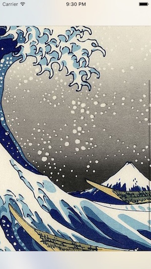

# ZoomableImageViewSample

このアプリケーションはイメージビューを拡大縮小表示するサンプルです。

## 特徴

* ダブルタップするとタップした位置が中心になるように拡大します。
* もう一度ダブルタップすると全体がすべて見えるように縮小表示します。
* イメージビューがナビゲーションバーとツールバーの下に潜り込む設定になっていても正しくレイアウトします。
* デバイスの回転に追従して適切に拡大縮小表示します。

## 動作環境

* Mac OS X Yosemite
* Xcode 7.3
* Swift 2.2
* iOS 8.1 以降

## ライセンス

* [MITライセンス](http://opensource.org/licenses/mit-license.php)

